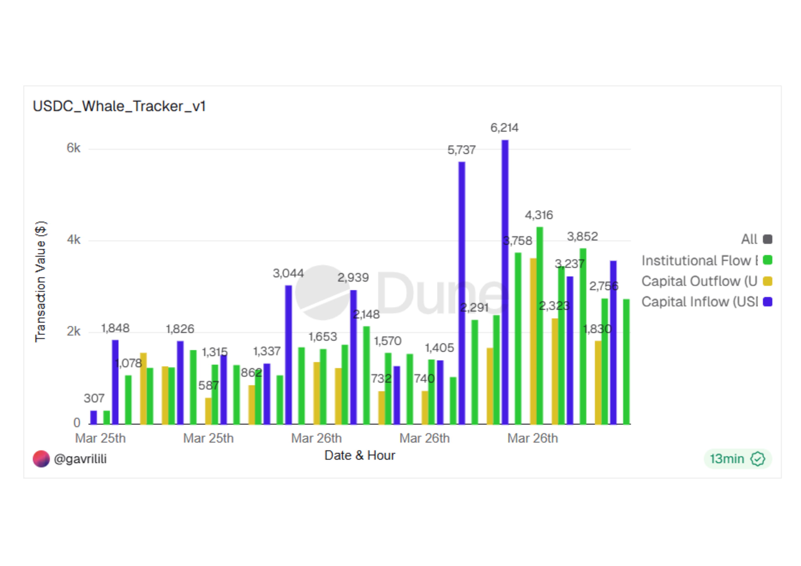
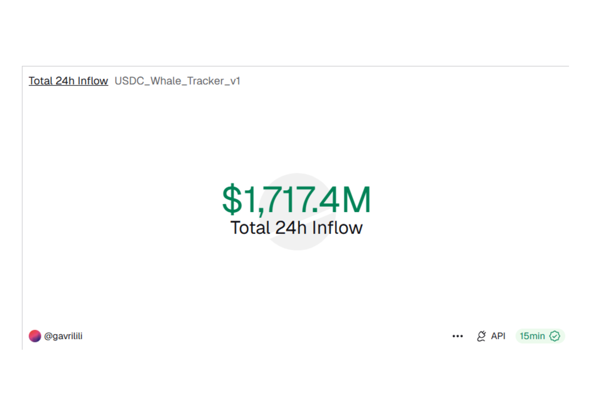

  <h1>📖 Technical Documentation</h1>
  <h3>Institutional USDC Whale Tracker</h3>
  
<i>Deep-dive into blockchain data analysis and visualization methodology.</i>

  

  

 

## 🛠️ Architecture & Data Logic
The core of this project lies in filtering high-value liquidity movements on the Ethereum network.

* **Data Source:** `erc20_ethereum.evt_Transfer`.
* **Whale Threshold:** Single transactions $\ge$ **$1,000,000 USDC**.
* **Time Window:** Rolling **24-hour** analysis.

  
  
<i>Figure 1: Real-time Inflow Counter showing institutional accumulation.</i>

## 📈 Visual Methodology
To ensure the data is actionable, we implemented two distinct layers of visualization:

1.  **Macro View (Counter):** Focuses on the "Big Picture" – total capital entry.
2.  **Micro View (Bar Chart):** Analyzes volatility and peaks. Notice the massive spikes at **6,214** and **5,737** units, indicating coordinated whale entries.

  
  
<i>Figure 2: Hourly breakdown of transaction value ($).</i>

## 📂 Asset Guide (How to add more)
To keep this repository clean, use the following syntax for new assets:

| Asset Type | Markdown/HTML Syntax |
| :--- | :--- |
| **Images** | `` |
| **Links** | `[Text](URL)` |
| **Reports** | `[Download PDF](Institutional_USDC_Whale_Analysis_Dune.pdf)` |

 

  

  
Generated for the <b>Web3 Data Portfolio</b> | 2026

